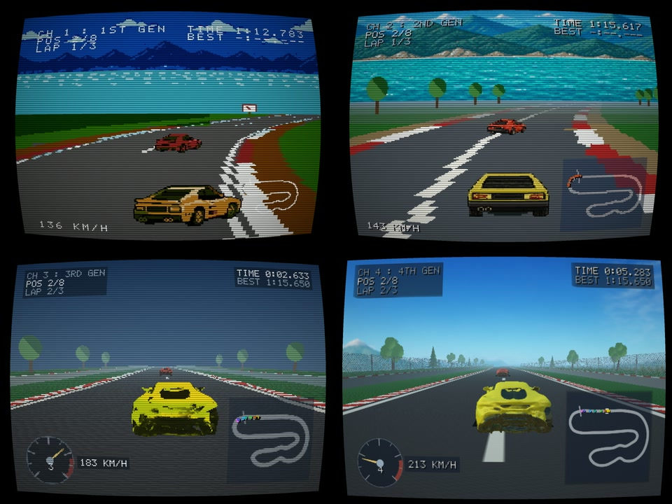

# Console Chaos Racing



FC / SFC / PS1 / PS2 の 4 世代表現を 1 つのシミュレーションの上で切り替えるエンジン
[ConsoleChaosEngine](https://github.com/Maoku/ConsoleChaosEngine)
を使って作ったレースゲームサンプル

**ブラウザですぐ遊べる: https://maoku.github.io/ConsoleChaosRacing/**

Claude Code / Opus5 で作成したもの。
車については
- 画像は GPT-Image-2
- 3Dモデルは MeshyAI
を使って別途用意しています

- 要求仕様: [`Docs/PLAN.md`](Docs/PLAN.md)
- 実装計画: [`Docs/IMPLEMENTATION_PLAN.md`](Docs/IMPLEMENTATION_PLAN.md)


## セットアップ

### 1. エンジンをクローンしてビルドする

```bash
git clone https://github.com/Maoku/ConsoleChaosEngine.git
cd ConsoleChaosEngine
npm install
npm run pack:distribution
```

- Node.js 22 以上が必要（エンジン側 `package.json` の `engines`）。
- `pack:distribution` は engine / engine-testkit / asset-pipeline の 3 パッケージをビルドし、
  `artifacts/` に tarball と `SHA256SUMS` を書き出す。本リポジトリが使うのは engine 本体
  （`artifacts/console-chaos-engine-0.2.0.tgz`）だけで、残り 2 つは不要。
- consumer 境界まで確かめたいときは代わりに `npm run verify:distribution` を使う。tarball を
  一時プロジェクトへオフラインインストールし、公開 API の import と型検査まで通す（その分遅い）。

### 2. エンジン tarball を配置する

ビルドした tarball を、本リポジトリの `reference/` 直下へ `console-chaos-engine-0.2.0.tgz`
という名前のまま置く（`package.json` の `file:` 参照がこの名前を指している）。本リポジトリの
ルートで、エンジンを隣に置いた場合:

```bash
cp ../ConsoleChaosEngine/artifacts/console-chaos-engine-0.2.0.tgz reference/
```

| 項目 | 値 |
| --- | --- |
| パッケージ | `@console-chaos/engine@0.2.0` |
| 生成元 | `ConsoleChaosEngine` の `npm run pack:distribution`（`artifacts/console-chaos-engine-0.2.0.tgz`） |
| SHA-256 | `e6b5b57c1a55179cccc3f1d690c1c481d418708f796039023dd6f4203b726d74` |

```bash
shasum -a 256 reference/console-chaos-engine-0.2.0.tgz
```

過去のバージョン:

| バージョン | SHA-256 |
| --- | --- |
| 0.1.0 | `0871693e0e662fab0652970d7e54dc10acd84ec4ce2a91000973ba44d41b1786` |

**この SHA-256 は「本リポジトリが動作確認に使った現物」の指紋であって、自分でビルドした
tarball の期待値ではない。** `npm pack` の出力は同じソースからなら 1 バイトまで再現するが、
エンジン側の `main` は同じ `0.2.0` のまま中身が進むことがある（実際、現在の `main` を
ビルドすると `dist/index.js` の内容が上表の tarball と一致しない）。したがって

- 誰かから受け取った tarball の同一性を確かめるときだけ、上表と照合する。
- 自分でビルドしたものに差し替えるときは、ハッシュ不一致を異常とみなさない。差し替え後に
  `npm run build` と `npm test` を通し、実画面を確認したうえで上表を新しい値に更新する。

### 3. 依存を入れる

```bash
npm install
```

`package-lock.json` は `file:` 参照を記録するだけで tarball の中身を持たない。したがって
**tarball を差し替えても lockfile は変わらず、古い `node_modules` のまま動いてしまう**。
エンジンを更新したときは必ず次を実行する。

```bash
rm -rf node_modules && npm install
```

導入できたかは開発サーバの起動で確かめる。

```bash
npm run dev
```

## 開発

| コマンド | 内容 |
| --- | --- |
| `npm run dev` | Vite 開発サーバ（http://localhost:5173） |
| `npm run build` | 型チェック＋本番ビルド（`dist/`） |
| `npm run preview` | ビルド結果のプレビュー |
| `npm run deploy:pages` | `dist/` を `gh-pages` ブランチへ公開（下記） |
| `npm test` | Vitest（純ロジックのテスト） |
| `npm run typecheck` | 型チェックのみ |
| `npm run check:cars` | 変換済み車アセットの SHA-256 照合（※変換元 GLB は公開リポジトリに含まれないため、クローンした状態では変換元の照合が失敗する。[data/README.md](data/README.md) 参照） |
| `npm run prepare:cars` | 変換元 GLB から車の runtime GLB と base color テクスチャを焼き直す（`-- --write` で書き出し。姿勢・原点・寸法の正規化を焼き込む。※変換元が要る） |
| `npm run measure:pace` | 敵車の速度スケールとペース較正を実測（下記） |
| `npm run build:minimap` | コース中心線からミニマップ PNG とマーカーを生成 |
| `npm run build:assets` | 生成系アセットをまとめて再生成 |

### バランス定数の較正

`BALANCE.SPEED_SCALE`（敵車の速度倍率）と AI のペース較正は、**コース形状と車両定数から
決まる実測値**であって手で選べる数ではない。要求は「敵車が走行中に出す最高速度が自機の
0.95 倍」だが、直線が短いこのコースでは定数を 0.95 倍しても実測比は 0.971 にしかならない
（詳細は [`Docs/BALANCE_PLAN.md`](Docs/BALANCE_PLAN.md) §2.3）。

したがって**コース形状・車両定数・AI のライン計算を変えたら必ず流し直す**。

```bash
npm run measure:pace
```

実測が現在の定数とずれていれば異常終了する。出た値で `src/game/sim/` の定数を置き換える。

## 操作

| 入力 | 動作 |
| --- | --- |
| ← → | ステア |
| Z | アクセル |
| X | ブレーキ |
| C | 視点切替（第3・第4世代） |
| Q / E | 世代切替（前 / 次） |
| 1〜4 | 世代の直接指定（HUD の `CH n` と対応） |
| F | フラットディスプレイ（画面の丸み）の ON / OFF |
| M | モアレ（走査線と蛍光体マスク）の ON / OFF |
| Esc | ポーズ |
| Backspace | タイトルへ戻る |

タイトル画面を 5 秒放置すると、5 秒ごとに 1 → 4 世代を巡回する（何か操作すると止まる）。

## GitHub Pages へ公開する

公開先は https://maoku.github.io/ConsoleChaosRacing/ 、配信元は `gh-pages` ブランチの
ルート（リポジトリの Settings → Pages → Source: *Deploy from a branch*）。

```bash
npm run build
npm run deploy:pages
```

`tools/deploy-pages.sh` が `dist/` をそのまま `gh-pages` ブランチへ置いて push する。
`.nojekyll` も一緒に置くので Jekyll の加工は入らない。

**ビルドは手元で行い、GitHub Actions では行わない。** 本リポジトリはエンジンを Git 管理外の
`reference/console-chaos-engine-0.2.0.tgz` から `file:` で参照しているため（上記セットアップ）、
クローンしただけの環境では `npm install` が通らない。エンジンの `main` から都度ビルドし直すと
中身が動作確認したものとずれる（「セットアップ」§2 の注記）。手元で確かめた現物をそのまま
配るほうが再現性が高い。

Vite の `base` は `'./'`（`vite.config.ts`）。生成物の参照が相対パスになるので、
`/ConsoleChaosRacing/` のようなサブパス配信でも素材の 404 が起きない。

## 動作要件

WebGL2 が使えるブラウザ。エンジンは ESM / ES2022 前提でビルドされている。

## ライセンス

MITライセンス

